# StreamingApp — MERN Microservices DevOps Platform

A complete CI/CD pipeline for a MERN microservices streaming application — from code push to a running, monitored application on Kubernetes, with ChatOps notifications.

**Repo:** `https://github.com/shinmaheshwari/streamingapp-devops-platform`
**Forked from:** [UnpredictablePrashant/StreamingApp](https://github.com/UnpredictablePrashant/StreamingApp)

---

## Architecture

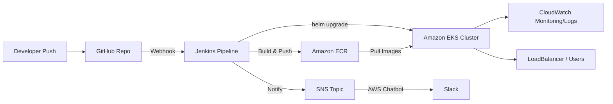

See [docs/architecture.md](docs/architecture.md) for the detailed component breakdown, and [docs/SETUP.md](docs/SETUP.md) for the full command-by-command setup guide.

## Services

| Service | Path | Port |
|---|---|---|
| helloService | `backend/helloService` | 3001 |
| profileService | `backend/profileService` (MongoDB Atlas) | 3002 |
| frontend | `frontend` (React, served via Nginx) | 80 |

## Tech Stack

- **Containerization:** Docker (Buildx, multi-platform builds)
- **CI/CD:** Jenkins (self-hosted on EC2, systemd service)
- **Image Registry:** Amazon ECR
- **Orchestration:** Amazon EKS (`eksctl`)
- **Deployment:** Helm
- **Monitoring/Logging:** Amazon CloudWatch (Container Insights)
- **Database:** MongoDB Atlas
- **ChatOps:** Amazon SNS → AWS Chatbot → Slack

## Repository Structure

```
.
├── backend/
│   ├── helloService/
│   │   ├── Dockerfile
│   │   └── ...
│   └── profileService/
│       ├── Dockerfile
│       └── ...
├── frontend/
│   ├── Dockerfile
│   └── ...
├── streamingapp-chart/              # Helm chart
│   ├── Chart.yaml
│   ├── values.yaml
│   └── templates/
│       ├── hello-deployment.yaml
│       ├── profile-deployment.yaml
│       └── frontend-deployment.yaml
├── Jenkinsfile
├── docs/
│   ├── architecture.md
│   ├── SETUP.md
│   └── screenshots/
└── README.md
```

---

## Setup Walkthrough (with evidence)

### 1. Fork & sync the repository

```bash
git clone https://github.com/shinmaheshwari/streamingapp-devops-platform.git
cd streamingapp-devops-platform
```


Add the upstream remote to keep the fork in sync with the original project:
```bash
git remote add upstream https://github.com/UnpredictablePrashant/StreamingApp.git
git fetch upstream
git merge upstream/main
```

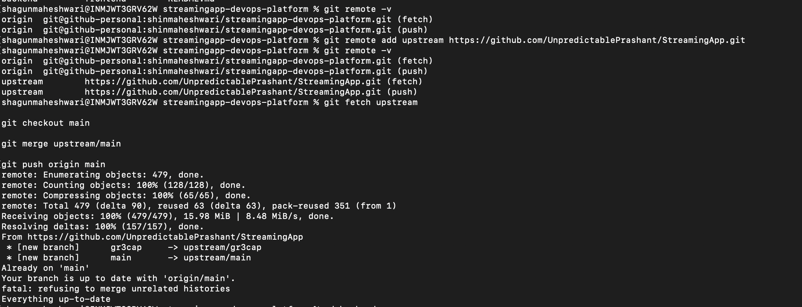

### 2. Containerize each service

Dockerfiles were written for all three components — `helloService` and `profileService` on `node:18-slim` (to avoid an Alpine/OpenSSL TLS issue connecting to MongoDB Atlas), and `frontend` as a multi-stage build served via Nginx.

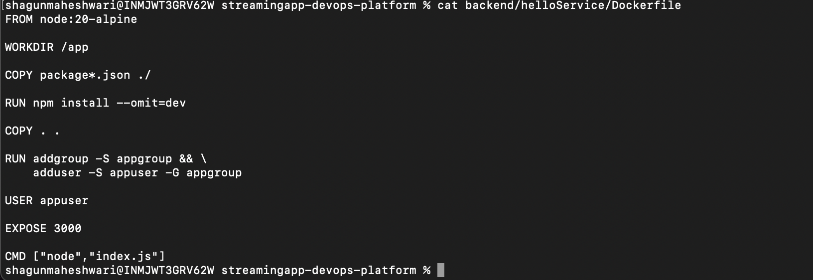
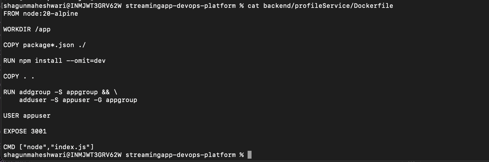
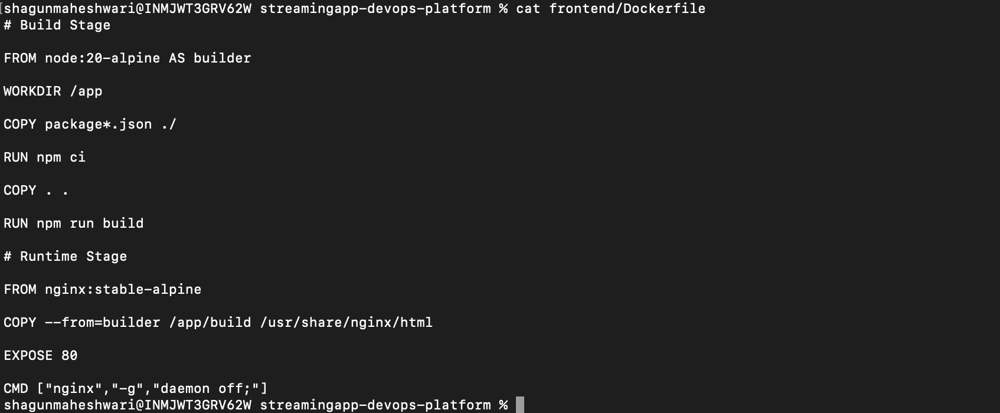

### 3. Build and test images locally

```bash
docker build -t streamingapp-helloservice:latest ./backend/helloService
docker build -t streamingapp-profileservice:latest ./backend/profileService
docker build -t streamingapp-frontend:latest ./frontend
```

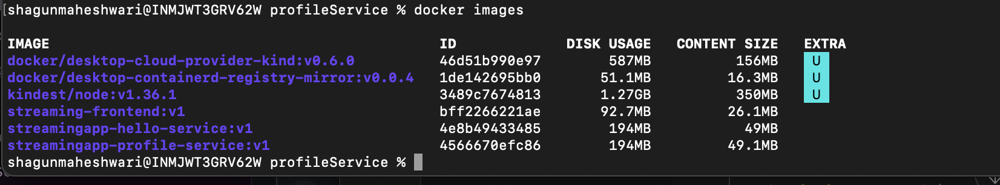

```bash
docker run -d -p 3001:3001 --name hello-test streamingapp-helloservice:latest
docker run -d -p 3002:3002 -e MONGO_URL='<connection-string>' --name profile-test streamingapp-profileservice:latest
docker run -d -p 8080:80 --name frontend-test streamingapp-frontend:latest
```

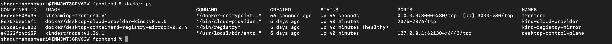

### 4. Configure AWS CLI

```bash
aws configure
aws sts get-caller-identity
```

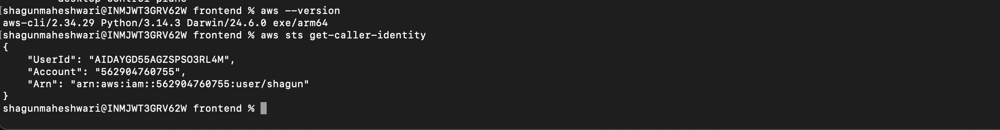

### 5. Create ECR repositories and push images

```bash
aws ecr create-repository --repository-name streamingapp-helloservice --region ap-south-1
aws ecr create-repository --repository-name streamingapp-profileservice --region ap-south-1
aws ecr create-repository --repository-name streamingapp-frontend --region ap-south-1
```

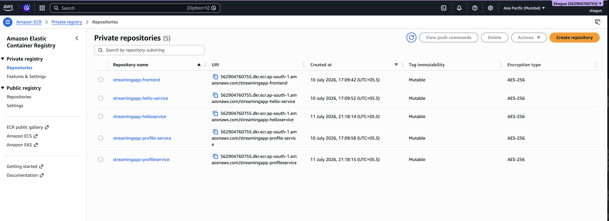

```bash
docker buildx build --platform linux/amd64 --provenance=false --sbom=false \
  -t <account-id>.dkr.ecr.ap-south-1.amazonaws.com/streamingapp-frontend:latest \
  --push ./frontend
# (repeat for helloService, profileService)
```

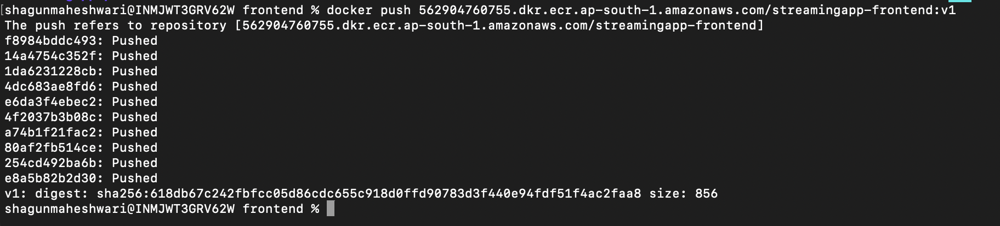
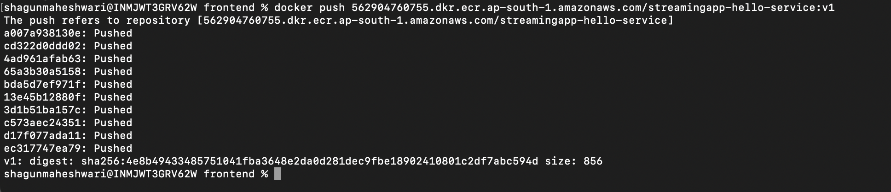
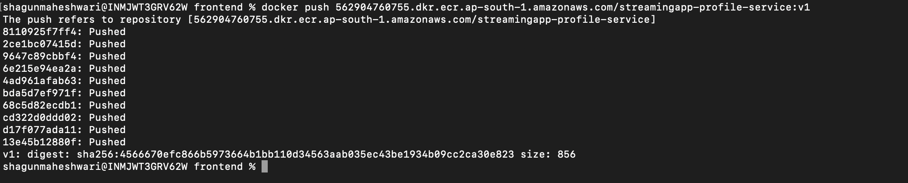

### 6. Provision the EKS cluster

```bash
eksctl create cluster \
  --name streamingapp-cluster \
  --region ap-south-1 \
  --nodegroup-name standard-workers \
  --node-type t3.medium \
  --nodes 2 \
  --managed
```

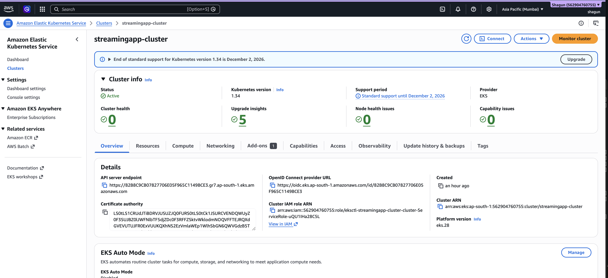

### 7. Deploy via Helm

```bash
kubectl create secret generic mongo-secret --from-literal=MONGO_URL='<connection-string>'
helm install streamingapp ./streamingapp-chart
```

```bash
kubectl get pods
```

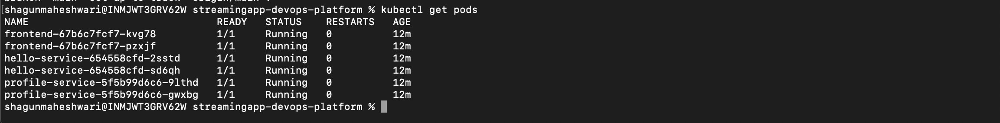

```bash
kubectl get svc
```

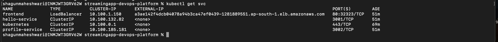

### 8. Verify the live application

Opening the LoadBalancer URL from the previous step in a browser:


### 9. Monitoring with CloudWatch

CloudWatch Container Insights deployed as a DaemonSet across the cluster:

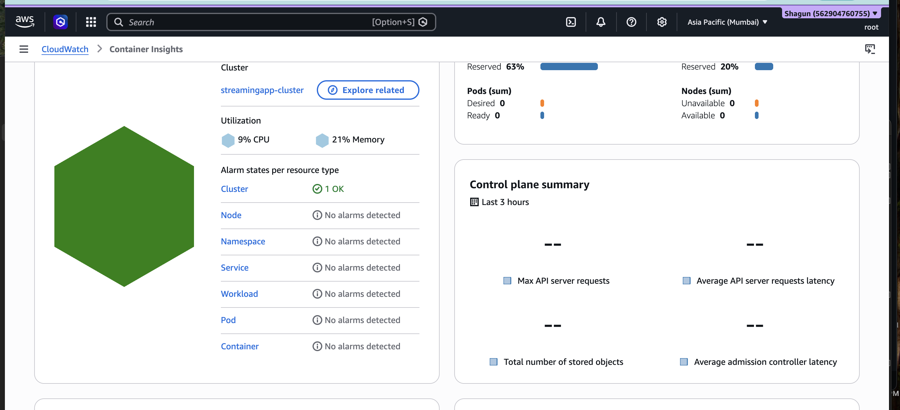
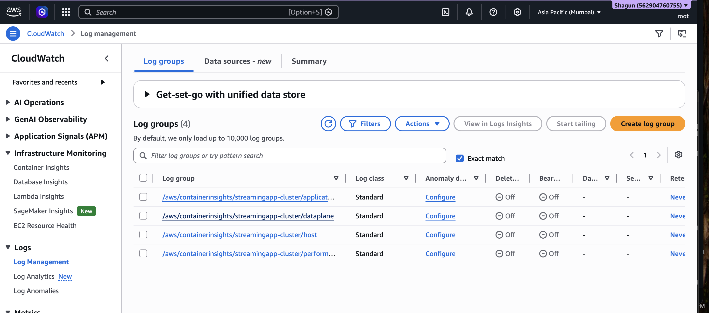

### 10. ChatOps — SNS notifications (bonus)

```bash
aws sns create-topic --name streamingapp-deploy-notifications --region ap-south-1
```

Subscribed to Slack via AWS Chatbot; Jenkins publishes to this topic on every build's success/failure.

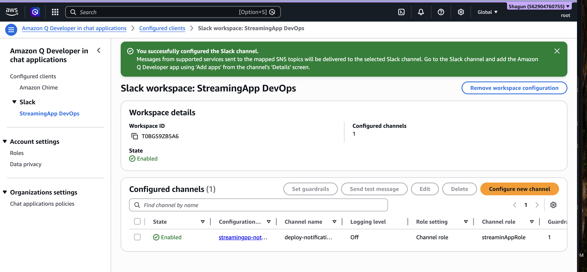

---

## CI/CD Pipeline

Every push to `main` triggers the Jenkins pipeline, which:
1. Cleans up old Docker images (disk space maintenance)
2. Checks out the repo via SSH
3. Builds and pushes all three images to ECR (`linux/amd64`, tagged with both build number and `latest`)
4. Deploys the update to EKS via `helm upgrade --install`
5. Publishes a success/failure notification to SNS → Slack

See the full [Jenkinsfile](Jenkinsfile) for the pipeline definition.

---

## Security Notes

- MongoDB credentials are never committed or baked into images — injected via a Kubernetes Secret (`mongo-secret`) at deploy time.
- `.env` files are `.gitignore`'d in both backend services.
- The Mongo Atlas password was rotated after being inadvertently exposed during development.
- AWS credentials are stored only as Jenkins credentials, never hardcoded in the `Jenkinsfile`.

## Cost Management

After grading/demo, the EKS cluster, its LoadBalancer, and the Jenkins EC2 instance were torn down to stop ongoing charges. ECR repositories, the SNS topic, and the Chatbot configuration were left in place (negligible cost) to preserve submission evidence. Full teardown commands are in [docs/SETUP.md](docs/SETUP.md#15-teardown--cost-cleanup).

## Documentation

- [Architecture](docs/architecture.md)
- [Full Setup Guide](docs/SETUP.md) — includes a complete troubleshooting log of every issue hit during setup
- [Jenkinsfile](Jenkinsfile)

