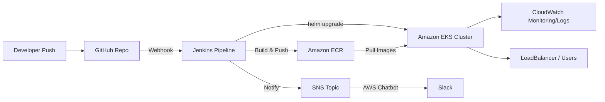
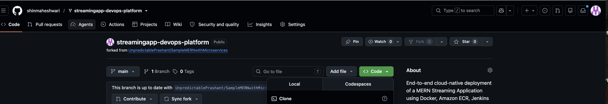
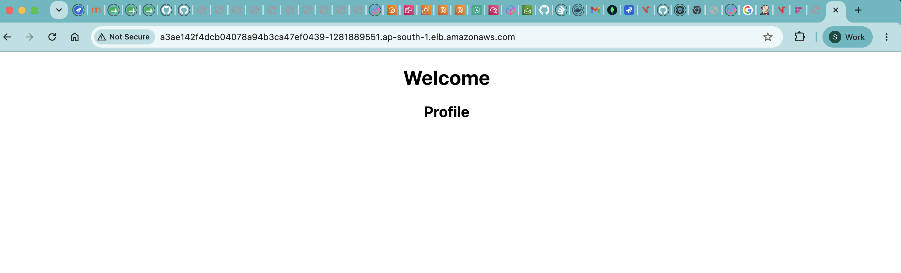

# StreamingApp — MERN Microservices DevOps Platform

A complete CI/CD pipeline for a MERN microservices streaming application — from code push to a running, monitored application on Kubernetes, with ChatOps notifications.

**Repo:** `https://github.com/shinmaheshwari/streamingapp-devops-platform`
**Forked from:** [UnpredictablePrashant/StreamingApp](https://github.com/UnpredictablePrashant/StreamingApp)

---

## Architecture



See [docs/architecture.md](docs/architecture.md) for the detailed component breakdown.

## Services

| Service | Path | Port |
|---|---|---|
| helloService | `backend/helloService` | 3001 |
| profileService | `backend/profileService` (MongoDB Atlas) | 3002 |
| frontend | `frontend` (React, served via Nginx) | 80 |

## Tech Stack

- **Containerization:** Docker (Buildx, multi-platform builds)
- **CI/CD:** Jenkins (self-hosted on EC2, systemd service)
- **Image Registry:** Amazon ECR
- **Orchestration:** Amazon EKS (`eksctl`)
- **Deployment:** Helm
- **Monitoring/Logging:** Amazon CloudWatch (Container Insights)
- **Database:** MongoDB Atlas
- **ChatOps:** Amazon SNS → AWS Chatbot → Slack

## Repository Structure

```
.
├── backend/
│   ├── helloService/
│   │   ├── Dockerfile
│   │   └── ...
│   └── profileService/
│       ├── Dockerfile
│       └── ...
├── frontend/
│   ├── Dockerfile
│   └── ...
├── streamingapp-chart/              # Helm chart
│   ├── Chart.yaml
│   ├── values.yaml
│   └── templates/
│       ├── hello-deployment.yaml
│       ├── profile-deployment.yaml
│       └── frontend-deployment.yaml
├── Jenkinsfile
├── docs/
│   ├── architecture.md
│   ├── setup-guide.md
│   └── screenshots/
└── README.md
```

---

## Evidence / Screenshots

All screenshots below live in [`docs/screenshots/`](docs/screenshots/).

| # | File | Shows |
|---|---|---|
| 1 | `01-GitHub-Fork.png` | Forked repo on GitHub |
| 2 | `02-Git-Remote-Upstream.png` | Git remotes configured (`origin` + `upstream`) for syncing the fork |
| 3 | `03-HelloService-Dockerfile.png` | `helloService` Dockerfile |
| 4 | `04-ProfileService-Dockerfile.png` | `profileService` Dockerfile |
| 5 | `05-Frontend-Dockerfile.png` | `frontend` Dockerfile |
| 6 | `06-Docker-Images.png` | `docker images` showing all three built images locally |
| 7 | `07-Docker-Containers-Running.png` | `docker ps` showing containers running/tested locally |
| 8 | `08-AWS-CLI-Configured.png` | `aws configure` / `aws sts get-caller-identity` confirming AWS CLI setup |
| 9 | `09-ECR-Repositories.png` | All three ECR repositories listed in the console |
| 10 | `10-ECR-Frontend.png` | Frontend ECR repo with pushed image tags |
| 11 | `11-ECR-HelloService.png` | helloService ECR repo with pushed image tags |
| 12 | `12-ECR-ProfileService.png` | profileService ECR repo with pushed image tags |
| 13 | `13-EKS-cluster.png` | `streamingapp-cluster` Active in EKS console |
| 14 | `14-kubectl-get-pods.png` | All 6 pods `1/1 Running` |
| 15 | `15-kubectl-get-svc.png` | `frontend` service with external LoadBalancer address |
| 16 | `16-app-frontend.png` | Working app in browser via the LoadBalancer URL |
| 17 | `17-cloudwatch-container-insights.png` | CloudWatch Container Insights dashboard |
| 18 | `18-cloudwatch-log-groups.png` | CloudWatch log groups for the cluster |
| 19 | `19-sns-topic.png` | SNS topic with Chatbot subscription |

Example embed (once files are in place):
```markdown


```

---

## Setup

Full step-by-step commands are in [docs/setup-guide.md](docs/setup-guide.md). Summary:

```bash
# 1. Clone and sync fork
git clone https://github.com/shinmaheshwari/streamingapp-devops-platform.git
cd streamingapp-devops-platform
git remote add upstream https://github.com/UnpredictablePrashant/StreamingApp.git

# 2. Build & push images (from repo root)
docker buildx build --platform linux/amd64 --provenance=false --sbom=false \
  -t <account-id>.dkr.ecr.ap-south-1.amazonaws.com/streamingapp-helloservice:latest \
  --push ./backend/helloService
# (repeat for profileService, frontend)

# 3. Deploy to EKS
aws eks update-kubeconfig --name streamingapp-cluster --region ap-south-1
kubectl create secret generic mongo-secret --from-literal=MONGO_URL='<connection-string>'
helm install streamingapp ./streamingapp-chart
```

CI/CD is automated end-to-end via the [Jenkinsfile](Jenkinsfile) — every push to `main` builds, pushes, deploys, and sends a Slack notification on success/failure.

---

## Issues Faced & Resolutions

A real record of every problem hit while building this out, in case future-you (or a grader) wonders why certain design choices were made.

| # | Issue | Root Cause | Resolution |
|---|---|---|---|
| 1 | `unable to prepare context: path "./helloService" not found` | Actual repo structure is `backend/helloService`, not root-level `helloService` | Corrected all Docker build paths to `./backend/helloService`, `./backend/profileService` |
| 2 | `MongoParseError: Invalid scheme, expected connection string to start with "mongodb://"...` | Mongo password contained an unescaped `@` character, breaking the connection string parser | URL-encoded special characters; ultimately rotated the password to avoid the issue entirely |
| 3 | `SSL alert number 80` / TLS handshake failure connecting to MongoDB Atlas | `node:18-alpine`'s musl/OpenSSL build has known TLS negotiation issues with Atlas | Switched backend Dockerfiles from `node:18-alpine` to `node:18-slim` |
| 4 | `Package 'jenkins' has no installation candidate` — GPG signature errors on `apt install jenkins` | Jenkins' apt repo key wasn't importing/verifying correctly on this Ubuntu version | Bypassed apt entirely — ran Jenkins via the official `.war` file directly, wrapped in a custom `systemd` service for persistence across reboots |
| 5 | `Running with Java 17... Supported Java versions are: [21, 25]` | Jenkins now requires Java 21+; EC2 only had Java 17 | Installed `openjdk-21-jdk`, set as default via `update-alternatives` |
| 6 | Docker builds hanging indefinitely with no error | Jenkins EC2 (`t3.micro`, ~900MB RAM) was memory-starved (Jenkins alone used ~50% of RAM) | Added a 2GB swap file as an immediate fix; recommended resizing to `t3.medium`+ for durability |
| 7 | `aws: not found` in Jenkins pipeline | AWS CLI wasn't installed on the (rebuilt) Jenkins EC2 instance | Installed AWS CLI v2 directly on the Jenkins box |
| 8 | `helm template: nil pointer evaluating .Values.httpRoute.enabled` | Leftover default template (`httproute.yaml`) from `helm create` referenced values that don't exist in a custom `values.yaml` | Deleted all unused Helm scaffold templates, kept only the three custom deployment/service files |
| 9 | Pods stuck in `ImagePullBackOff`: `NotFound... not found` | `values.yaml` pointed at the wrong AWS region (`us-east-1` instead of the actual `ap-south-1` where the ECR repos live) | Corrected the registry hostname region in `values.yaml` |
| 10 | Pods stuck in `ImagePullBackOff`: `no match for platform in manifest: not found` | Images were built on Apple Silicon (`arm64`) via Docker Desktop, but EKS worker nodes run `amd64`; additionally, Buildx's default provenance/SBOM attestation wrapping confused containerd's manifest resolution | Rebuilt all images with `docker buildx build --platform linux/amd64 --provenance=false --sbom=false` |
| 11 | `403 Forbidden` pushing to ECR mid-build | ECR auth token had expired (12-hour validity) | Re-ran `aws ecr get-login-password \| docker login` before retrying the push |
| 12 | Jenkins pipeline failed with `SynchronousResumeNotSupportedException` after a Jenkins restart mid-build | The `git` checkout step doesn't support resuming across a Jenkins controller restart | Wrapped the checkout stage in `retry(conditions: [nonresumable()], count: 2)`; also root-caused the Jenkins restarts to low memory/disk |
| 13 | SNS messages published successfully but never appeared in Slack | AWS Chatbot silently drops plain-text SNS messages from custom (non-AWS-service) sources — it requires a specific JSON schema | Reformatted all `aws sns publish` calls to Chatbot's required schema: `{"version":"1.0","source":"custom","content":{"textType":"client-markdown","title":"...","description":"..."}}` |
| 14 | Jenkins build stuck forever on `Waiting for next available executor` | Jenkins' built-in node auto-goes offline when free disk space drops below 1GB (accumulated Docker build cache/layers filled the disk) | Ran `docker system prune -a -f --volumes` to reclaim space, brought the node back online |

---

## Security Notes

- MongoDB credentials are **never** committed to the repo or baked into images — injected via a Kubernetes Secret (`mongo-secret`) at deploy time.
- `.env` files are `.gitignore`'d in both backend services.
- The Mongo Atlas password was rotated after being inadvertently shared in a chat session during development.
- AWS credentials are stored only as Jenkins credentials (`aws-creds`), never hardcoded in the `Jenkinsfile`.

## Cost Management

To avoid ongoing AWS charges after grading/demo, the following were torn down: EKS cluster (`eksctl delete cluster`, which also removes the associated NAT Gateway and VPC resources), the LoadBalancer service (deleted before cluster teardown to avoid an orphaned ELB), the Jenkins EC2 instance, and any unattached Elastic IP. ECR repositories, the SNS topic, and the Chatbot configuration were left in place (negligible/zero cost) to preserve submission evidence.

## Documentation

- [Architecture](docs/architecture.md)
- [Full Setup Guide](docs/setup-guide.md)
- [Jenkinsfile](Jenkinsfile)
,/.m 
