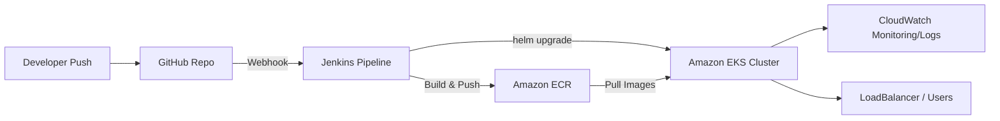

# System Architecture

## Overview

This project implements a full CI/CD pipeline for a MERN microservices streaming application, from code push to a running, monitored application on Kubernetes.

## Flow Diagram

## Components

### 1. Source Control — GitHub
- Repository: `shinmaheshwari/streamingapp-devops-platform`, forked from `UnpredictablePrashant/StreamingApp`
- Contains three application components (`helloService`, `profileService`, `frontend`), each with its own `Dockerfile`
- A GitHub webhook notifies Jenkins on every push to `main`

### 2. Continuous Integration — Jenkins
- Self-hosted on an EC2 instance (Ubuntu, `t3.medium`), running as a systemd service
- Pipeline defined in [`Jenkinsfile`](../Jenkinsfile) at the repo root
- On each trigger, the pipeline:
  1. Checks out the latest code via SSH (deploy key credential)
  2. Builds three Docker images (`helloService`, `profileService`, `frontend`)
  3. Authenticates to Amazon ECR
  4. Tags and pushes all three images
  5. Deploys the updated images to EKS via Helm

### 3. Image Registry — Amazon ECR
Three private repositories, one per service:
- `streamingapp-helloservice`
- `streamingapp-profileservice`
- `streamingapp-frontend`

Images are tagged with the Jenkins build number for traceability.

### 4. Orchestration — Amazon EKS
- Cluster: `streamingapp-cluster`, provisioned via `eksctl`
- Worker nodes run in a managed node group
- Node IAM role has `AmazonEC2ContainerRegistryReadOnly` (to pull images) and `CloudWatchAgentServerPolicy` (for monitoring) attached

### 5. Deployment — Helm
- Chart: `streamingapp-chart/`
- Three Deployment + Service pairs, one per component
- `frontend` service is `type: LoadBalancer` (external access)
- `hello-service` and `profile-service` are `type: ClusterIP` (internal only — only the frontend needs to reach them)
- Image tags and replica counts are parameterized via `values.yaml`, overridable at deploy time (`--set` flags in the Jenkinsfile)

### 6. Secrets Management
- The MongoDB Atlas connection string is stored as a Kubernetes Secret (`mongo-secret`), injected into `profile-service`'s pod as an environment variable via `secretKeyRef`
- It is never committed to the repo, written into a Docker image, or hardcoded in a Helm template

### 7. Monitoring & Logging — Amazon CloudWatch
- CloudWatch Container Insights deployed as a DaemonSet (CloudWatch agent + Fluent Bit) across the cluster
- Sends cluster, node, and pod-level metrics to CloudWatch, and centralizes application/container logs
- A CloudWatch alarm monitors node CPU utilization

### 8. Notifications (Bonus) — Amazon SNS
- SNS topic `streamingapp-deploy-notifications` receives deployment success/failure events from the Jenkins pipeline
- Subscribed to a Slack channel via AWS Chatbot for real-time ChatOps alerts

## Data Flow Summary

1. Developer pushes code → GitHub
2. GitHub webhook triggers Jenkins
3. Jenkins builds and pushes three Docker images to ECR
4. Jenkins runs `helm upgrade --install`, pointing EKS at the new image tags
5. EKS pulls the new images from ECR and rolls out updated pods
6. `profile-service` connects to MongoDB Atlas using credentials from a Kubernetes Secret
7. CloudWatch continuously collects metrics/logs from the cluster
8. SNS notifies the team (via Slack) of deployment outcome
9. End users access the app through the frontend's LoadBalancer endpoint
